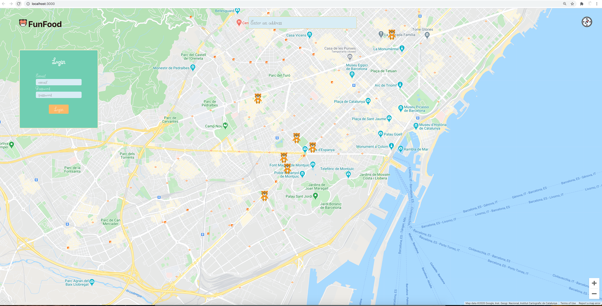

# FunFood

# What is FunFood
🐯 An app to help parents find restuarants where they can enjoy and their child have fun. 🐯

👨‍👩‍👧‍👦 The purpose of the app is make life of parents easier and practice react hooks.

# Running FunFood
Clone the repo on your machine with the command npm start | yarn start, it depends which dependency you are running globally.

Then open the repo in your preferreble clde editor. I use vscode.
Go into the server folder and typw npm i, to install all the necessaries dependencies.
Now you can start the server by typing nodemon or node index.js.
You should get a message of server running on localhost...

Now go back to the directory src and run npm i for the front end dependencies.
Set .env.local with react_api_key= "you need yo get an api key on google dev"
Otherwise the map wont be rendered.

# Observations:
The app is very raw, the first step would implement a relational database(postgres)
Need to add filter options for which type of feature parents are looking in the restaurant.
Defnetyl better CSS and more animations.
Authentication and authorization for users and restaurant owners.
Option to rate the restaurant, leave a comment, and endorse each feature of the restaueant.
Each fesature should be rendered different depending by how nice it is.

Premium option for restaurants
And for users(adding discounts)

## Table of contents

[Running FunFood](#running-funfood)  
[Observations](#observations)  
[Tech Stack](#tech-stack)  
