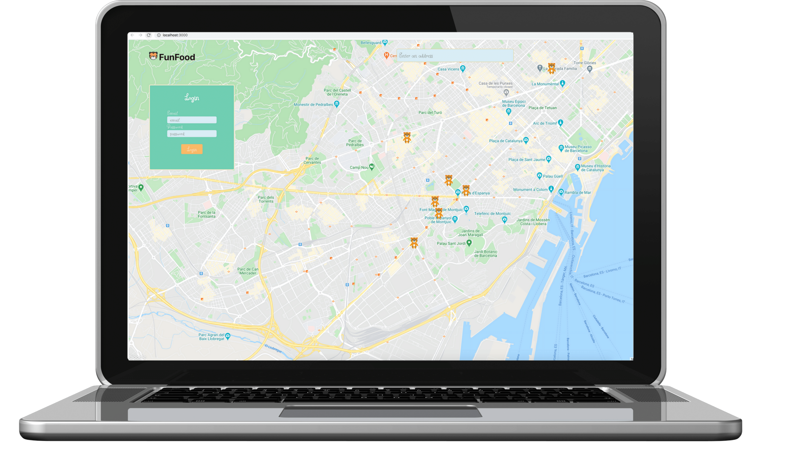
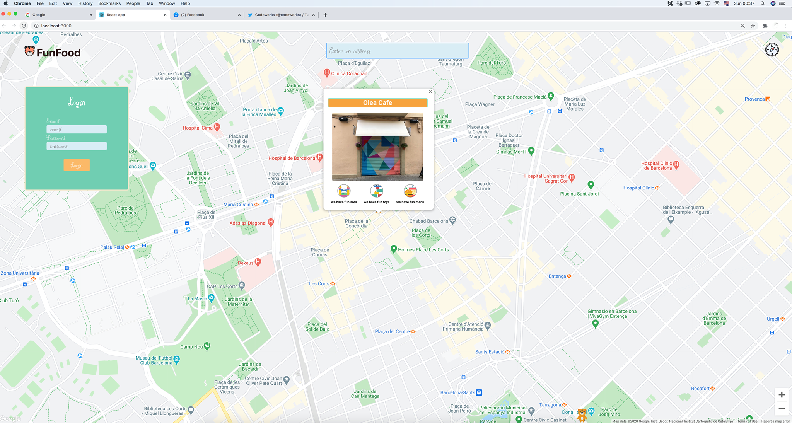

 
 

# What is FunFood
🐯 An app to help parents find restaurants where they can enjoy and their child have fun. 🐯

👨‍👩‍👧‍👦 The purpose of the app is to make the life of parents easier and to practice react hooks.
 
 

## Table of contents

[Running FunFood](#running-funfood)  
[Observations](#observations)  
[Tech Stack](#tech-stack)  

# Running FunFood
- Fork & clone this repo  
  Run `npm i` in funfood/server directory to install the backend dependencies. 
  Now run `nodemon index.js` and you should get this message:
`🚀app running at http://localhost:5005`

- Now go back to funfood directory and run `npm i`for the frontend dependencies. 
  Adjust the .env.local to with react_api_key= "your API 🔑 "
  (You need to get an api key on google dev, if not the map wont be rendered.)
  Run `npm start`

# Upcoming improvements :
- Migrate to a relational database(postgres)
- Add filter options for which type of feature parents are looking in the restaurant.
- Optimize css with animations.
- Authentication and authorization for users and restaurant owners.
- Option to rate the restaurant, leave a comment, and endorse each feature of the restaueant.
- Each restaurant feature should be rendered more different in relation to how nice is the restaurant.
- Premium option for restaurants and for users(adding discounts)
- Option to pay with the application.

## Tech Stack

:tiger: [React](https://reactjs.org/)  
:tiger: [Express](https://expressjs.com/)  
:tiger: [mongoDB](https://www.mongodb.com/)  
:tiger: [Sequelize](https://sequelize.org/)  
:tiger: [mongoose](https://mongoosejs.com/)   
:tiger: [Google Places API](https://cloud.google.com/maps-platform/places)

